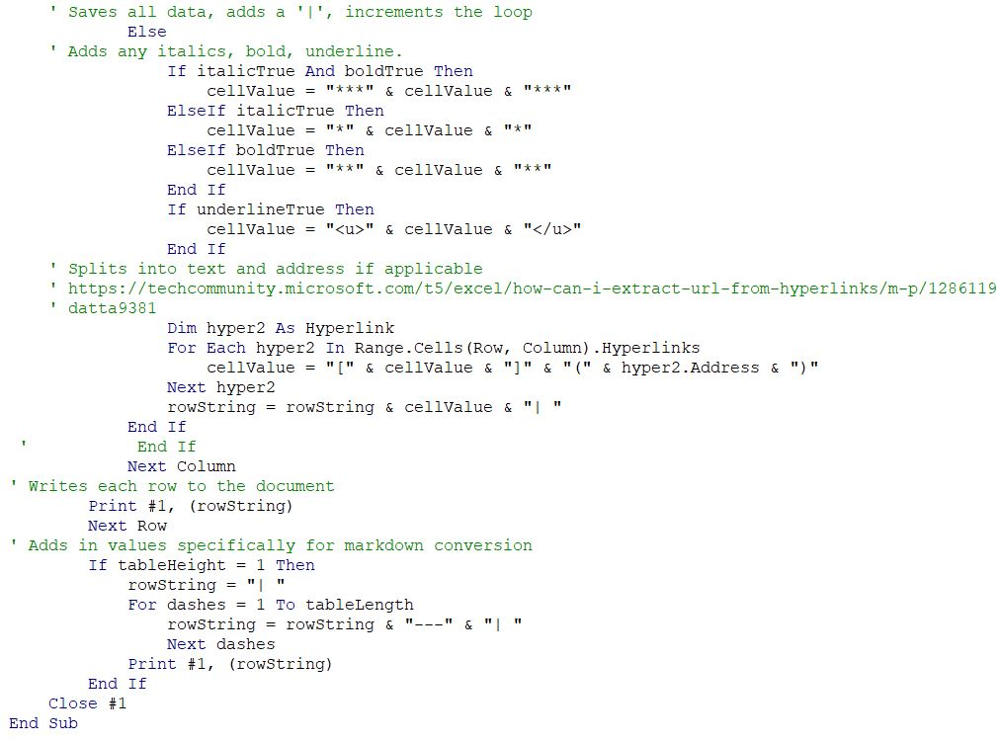

# **Excel to Markdown**
[<u>To Webpage</u>](https://swampysquid.github.io/ExcelToMarkdown/)

**By: Eythan Jenkins**
## <u>Summary</u>

This Macro will take in a cell selection made by the user in Excel, and convert it into a .txt file for the user to then copy into a Markdown-formatted webpage to generate a Markdown table. The .txt file will be titled 'copyFile', and will be written on the user's computer. The user will also have three auxiliary options when it comes to generating the .txt file. Any Excel cells marked with an '!' will be blanked out in the .txt file. Any Excel cells marked with an '!!' will be blanked out in the .txt file, in addition to any cells in the same column which follow that cell. Finally, any Excel cells marked with '!!!' will have their hyperlink disabled, so that only text is converted from the Excel cell into the Markdown table. A sample Excel Sheet to Markdown Table is below, and will be referred to later on to help convey the ideas of this VBA program.  

## <u>Excel Sheet</u>

## <u>Excel to .txt File</u>

## <u>Resulting Table from Copying the .txt</u>

| | **Day**| **Topic**| **Due**| 
| ---| ---| ---| ---| 
| | | | | 
| 1/18/2021| 1| [<u>What is Data Science </u>](https://docs.google.com/document/d/1yhVB9DfddvJIiXitX2ZC1W0D3cJbcvib5fWmUlgqNO0/edit)| | 
| 1/20/2021| 2| [<u>VBA</u>](https://docs.google.com/document/d/1ASoeI5CjFgyQTBm-HFPvmRC_94niTPx4s9crQEDVb10/edit)| [<u>HW1 - Excel</u>](https://docs.google.com/document/d/1g8eOYNe9sDmrstRgvFRZBskxjaIaD7Za4lFXSgPPkVw/edit)| 
| 1/25/2021| 3| [<u>Data Communication</u>](https://docs.google.com/document/d/1PTe_eezbRdZcxIOODyiQzDM4vtjVNJkVDC_7vZQSoZE/edit)| | 
| 1/27/2021| 4| Work Day| <u>HW2 - VBA</u>| 
| 2/1/2021| 5| Why are data visualizations important ?| [<u>Reading Due - Florence Nightengale</u>](https://docs.google.com/forms/d/1FBgScIpV9Vpa-jb1nlWuoCqOxFE7v5SmQtacpFHpIq8/edit)| 
| 2/3/2021| 6| Tableau| [<u>COVID Risk Calculator</u>](https://www.nytimes.com/2021/12/30/style/covid-risk-calculator.html)| 
| 2/8/2021| 7| How visualizations lie| [<u>Reading Due - Differnet Kinds of Data Visualization</u>](https://github.com/arielcwebster/DataScience/blob/main/visualdatacommunication.pdf)| 
|  | 8| Work Day| [<u>HW 3 - Tableau</u>](https://docs.google.com/document/d/1bta4t39rpvl-kXgO2pmZPGypWnYyBbiyzCPek9kxv9E/edit)| 
| 2/15/2021| 9| Danielle| Reading Due - How Charts Lie| 
| 2/17/2021|  |  |  | 
| 2/22/2021|  | [<u>Doing Better Data Visualization (R and ggplots tutorisl)</u>](https://github.com/arielcwebster/DataScience/blob/main/Doing Better Data Visualization _ Enhanced Reader.pdf)|  | 
| 2/24/2021|  | Work Day|  | 
| 3/1/2021|  | Sentiment Analysis - History and Types|  | 

## <u>Macro Usage</u>

There are up to 4 operations involved in using this Macro:

### <u>Initial Selection</u>

The initial selection dictates the range that this Macro has. By selecting a box on Excel, then activating the Macro, the Macro will produce the .txt file whose scope is that of your selection. This is demonstrated in the sample code: the user has selected cells A1:D15, therefore the Macro will only obtain values from A1:D15.

### <u>Single Cell Blanking</u>

The first auxiliary user option is to place an '!' in front of a cell. This will omit that cell's text from entering the .txt file, therefore preventing that cell from appearing on the Markdown Table. This is demonstrated in cells A10 and C12. Both of these cells do not appear on the resulting Markdown Table.

### <u>Column Blanking</u>

The second auxiliary option is to place an '!!' in front of a cell. Placing '!!' will not only perform the same function as '!', but will also perform the '!' function to all cells in the same column which come after the '!!' cell. This is demonstrated in cells B12 and D12. Both of these cells, as well as the future cells in columns B and D, do not appear on the Markdown Table due to the '!!' option.

### <u>Disable Hyperlinks</u>

The final auxiliary option is to place '!!!' in front of a cell. This option will disable the hyperlink associated with that cell, making only the text in that cell convert to the Markdown Table. This is demonstrated in cell D6. D6 has an active hyperlink in the Excel sheet, but in the Markdown Table, the hyperlink has been disabled and only the text appears. 

## <u>How the Code Works</u>

The first bit of code establishes a text file which will be written into by the Macro. Additionally, it declares range as the selection the user has made in the Excel sheet. It uses this selection to create two dimensions: tableHeight and tableLength. Finally, a dynamically sized array is established, which will hold the number of a column which is 'blacklisted,' indicated by '!!' in the excel cells. \[Reference 1]

__________________________________

The second piece of my code begins the reading operation: it will go row-by-row, then column-by-column to read the information of the Excel cells. The .txt file will be written into row-by-row by using a String named rowString. This will contain the contents each row of the Markdown Table will consist of. An additional part of this code is an If statement which flags when Row = 2. When Row = 2, I must add syntax for the .txt file to be Markdown congruent. 

This code will then enter a nested loop, where I enter the column-by-column counter. For each column, I look through my dynamic array to make sure that the column doesn't match a blacklisted one. If it matches a blacklisted column, the cellValue variable will = '!'. If the column is a good column, I will save the data in the corresponding Excel cell into the cellValue variable. \[Reference 2]

__________________________________

The next segment looks closer at the data within a selected cell. It generates boolean values for whether the cell is underlined, bold, or italicized, and will turn these values true if the Font of the cell fulfills these requirements.

__________________________________

This segment of the code is in control of the auxiliary options. It uses a decision structure to see how many '!' exist behind a cell, if any. At the innermost is the decision if there is '!!!', in which case a loop is entered which looks for the hyperlink in that specific cell. It will check if the hyperlink is equal to the text (i.e. https://...). If equal, then the hyperlink will be disabled. Else, the text is already different than the hyperlink, so separating the two values from each other will be sufficient. This section also adds any bold, italicized, or underline notation as needed to variable cellValue, and finally adds the produced cellValue to rowString with a '|' for syntax. \[Reference 2]

__________________________________

This segment of code corresponds to the '!!' and '!' functions. '!!' will blacklist column values by redimensioning an array to hold a new value. The array preserves any old blacklisted values, so that it can contain more than one blacklisted column at a time. '!' simply blanks out the cell. \[Reference 1]

__________________________________

This segment of code continues with the else case, if no '!','!!', or '!!!' was found. It first looks for italicized, bolded, or underlined, and will make necessary changes to cellValue based on these decision statements. After this, it will split apart the text from any embedded hyperlink, if applicable, so that the text will show, but the hyperlink will be included in the .txt file for export into a Markdown format. After all of the columns loop through, the rowString will be printed onto the .txt file, and a new rowString will begin to be created. After all of the rows have been looped through, the program closes the .txt file and the program ends. There is also a small segment of code similar to the code near the start of the program; this code checks if there is only one row in the user's selection. If so, it tacks on the Markdown formatting necessary, which wouldn't be triggered by the code elsewhere. \[Reference 2]

__________________________________

## <u>References</u>

\[[My Code(Excel with Macro)](https://github.com/Swampysquid/ExcelToMarkdown/blob/gh-pages/Spring%202022%20-%20Data%20Science%20Schedule%20WIth%20MAcro.xlsm)]

This is my code, as a Macro in the attached Excel File

\[[My Code(Text File)](https://github.com/Swampysquid/ExcelToMarkdown/blob/gh-pages/NotepadCode.txt)]

This is my code, copied into a .txt file.

\[[Reference 1](https://excelmacromastery.com/excel-vba-array/)]
Anything marked with \[Reference 1] in my code, I used to help me understand arrays, dynamic v. static, and how to redimension arrays.

\[[Reference 2](https://techcommunity.microsoft.com/t5/excel/how-can-i-extract-url-from-hyperlinks/m-p/1286119)]
Anything marked with \[Reference 2] in my code: I derived the for-loop structure for finding hyperlinks from this link. I modified it to check either the blacklisted array, or to extract the hyperlink in a given cell. The original code was from user 'datta9381,' whose code was this:

